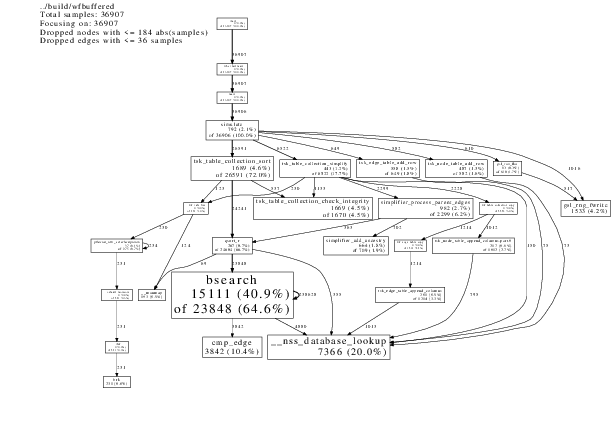
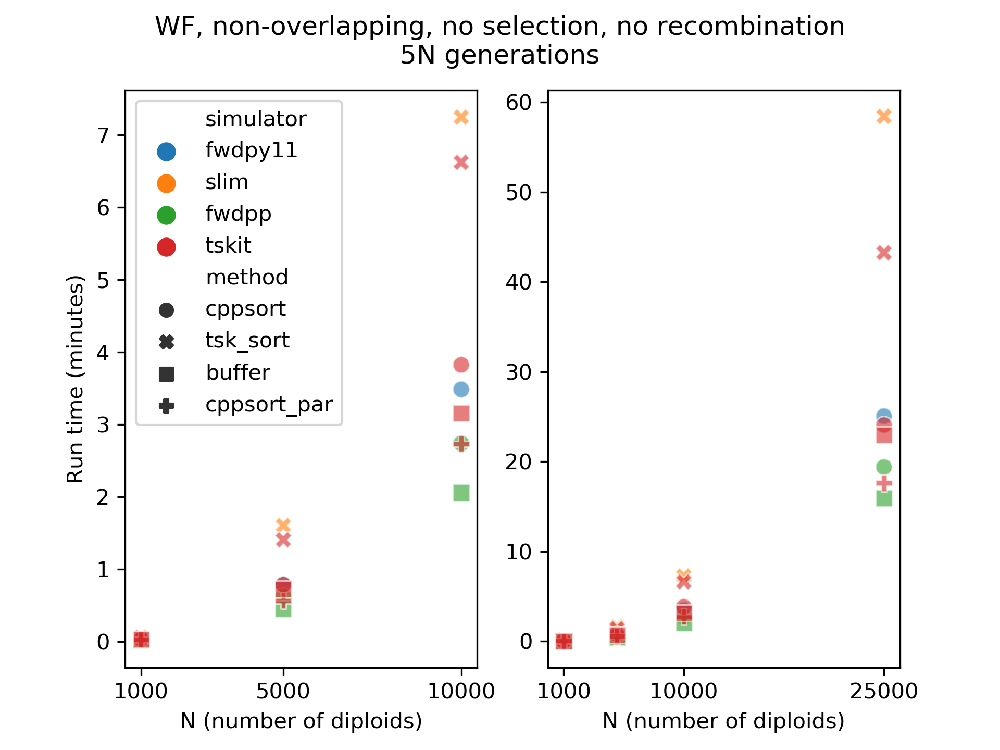
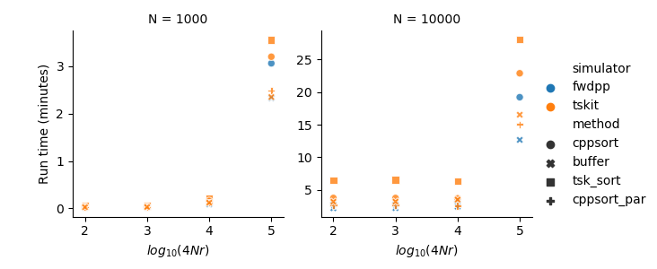

```{r setup, include=FALSE}
library(knitr)
library(rmarkdown)
library(reticulate)
knitr::opts_chunk$set(echo = FALSE)
```

## Tree sequence recording

```{r,echo=F,fig.align="center",out.width="3.0in",out.height="2.0in"}

```

## Lots of lineages fail to reproduce


```{r,echo=F,fig.align="center",out.width="3.0in",out.height="2.0in", fig.cap="A few generations of a Wright-Fisher simulation."}
include_graphics("messy.png")
```

## We can clean this up in linear time

```{r,echo=F,fig.align="center",out.width="3.0in",out.height="2.0in", fig.cap="Simplification returns a minimal history + a mapping from input to output nodes. The details are in Kelleher, et al. 2018. PLoS Computational Biology."}

```

## The procedure

### What we are doing:

* Record births = make new nodes and edges.
* Every now and again, **sort and simplify** the tables.
* Repeat until done.

### What we would rather be doing:

* Record births = make new nodes and edges.
* Every now and again, **simplify** the tables.
* Repeat until done.

### Our goal

* Eliminate sorting!

## Simulators and sorting methods

### Simulators 

\footnotesize
* ``fwdpy11`` is written by me.  Uses an independent implementation of a table collection.  Sorting is in C++.
* ``slim`` means ``slim/master`` cloned on 12 May, 2020. ``slim`` uses ``tskit`` for all the tree sequence bits.
* ``tskit`` means a simple simulator I wrote using ``tskit``.  It has command line options to sort tables in a bunch of ways.
* ``fwdpp`` means a simple simulator I wrote using ``fwdpp``.  It has command line options to sort tables in a bunch of ways.
  Sorting is in C++.

(The `tskit` and `fwdpp` simulators give the same tree sequences/table collections for the same seed.)
\normalsize

### Sorting methods

\footnotesize
* ``tskit`` means using ``tsk_table_collection_sort``, which relies on ``C``'s ``qsort``.
* ``cppsort`` means using ``C++``'s ``std::sort``.
* ``cppsort_par`` means using ``C++17``'s parallel sort. This requires ``GCC9.1`` or later and is implemented using Intel's ``TBB`` library.
\normalsize

## Simulation details

Run for ``5N`` generations.  Simplify every 100 generations.  Write a ``tskit`` "tree file" at the end.

\tiny
```{sh, code = readLines("../benchmarking/slimulate.sh"), eval = F, echo = T}
```
\normalsize

## Simulation details

\tiny
```{python, code = readLines("../benchmarking/run_fwdpy11.py"), eval = F, echo = T}
```
\normalsize

## The sorting is expensive

```{r,echo=F,fig.align="center",out.width="3.5in",out.height="2.0in", fig.cap="Percent of run time spent sorting. I'm comparing fwdpy11, which sorts tables using C++ to a simple simulator written using tskit. Sort algorithms have NlogN complexity. In C++11 and later, that is a worst-case bound."}
include_graphics("../benchmarking/neutrality_time_sorting.png")
```

## The sorting is expensive
```{r,echo=F,fig.align="center",out.width="3.5in",out.height="2.0in", fig.cap="Same data as previous, but showing the actual run times."}
include_graphics("../benchmarking/neutrality_benchmark_simpler.png")
```

## Let's open the black box
```{r,echo=F,fig.align="center",out.width="3.5in",out.height="2.0in", fig.cap="Call graph for tskit using tskit sorting. N = 10,000.  Generated via Google's ``perftools``."} 


```

## The problem

* Sorting is expensive
* Sorting is faster in C++ than in C. This is mostly due to inlining the comparison function.

## Solutions that still involve sorting

* Jerome is already working on a ``PR`` that allows you to pass in your own sorting function.
* This will let ``slim`` use the ``C++`` sort and experiment with parallel sorting.
* However, we don't need to sort at all!

## Edge "buffering"

* Forward simulators already generate edges in (close to) sorted order.
* Births happen past to present.  Sorting just reverses that.
* The simulator already needs to have breakpoints ordered so that it can work properly, so let's just
  write down `(child, left, right)` as we go! (Yes, this sounds rather obvious.)
* Going backwards through this buffer will yield our edges in the proper sorted order in *linear* time.

## An edge buffer

\small
We track ``(left, right, child)`` data for each parent via a linked list.  The list is empty (``head[parent] == -1``)
if no offspring, else it is the index of the first birth.  Births contain the index of the next birth from 
the same parent. All the linked lists are shoved into a single contiguous vector.

\tiny
```{cpp, eval=F, echo=T}
struct BirthData
{
    double left, right;
    tsk_id_t child;
    std::int64_t next; // -1 = NULL/tail
};

struct EdgeBuffer
{
    // len(node table), -1/NULL if
    // a parent node has no offspring nodes
    std::vector<std::int64_t> head;
    // A vector of many linked lists
    std::vector<BirthData> births;
};
```
\normalsize

(The current implementation also tracks the lists' ``tail``s.)

## Example

```{r,echo=F,fig.align="center",out.width="2.0in",out.height="1.0in"}

```
```{r,echo=F,fig.align="center",out.width="4.0in",out.height="1.0in"}

```

## Liftover to the edge table

This is trivial for non-overlapping generations:

* Go backwards through ``head``
* Traverse each list and add rows to a new edge table.
* Add rows from the existing edge table.

This isn't what we do, because it doesn't generalize to individuals of different ages.

## Handling overlapping generations

Keep a list of nodes that were alive the last time we simplified. Call this list ``A``.  Then, next time we simplify:

\small
* For each node, record the first/last index where it is a parent in the edge table. (Linear, but should experiment w/binary search because there should only be sorted edges in there?)
* For all entries ``a`` in ``A`` that left offspring, collect ``(a, first, last)`` into list ``L``. (Linear)
* Sort ``L`` according to ``(birth time[a], first, a)``.  (Small NlogN)
* As before, go backwards through new births, now stopping when we hit the last simplification time. (Linear)
* Co-iterate through the edge table and ``L`` to "stitch" together the remaining edges. (Linear)
\normalsize

This was the hard part.

## Testing

* Write a tree file with sorting and buffering using the same seed.
* To test that topologies are the same, compare the distance matrix (branch stat) with respect to samples.
* Cannot compare topologies directly because the buffering method relies on relaxed sorting criteria.
  (Parents are not sorted lexically within birth time.  This is fine.)
* Can only compare for ``N = 1,000`` (2,000 nodes) because the tree sequence stat machinery
  takes over 30GB for this case.

## Benchmarking

* 6 core (12 thread) Intel `Xeon W`.
* Measure total run time and peak RAM use.
* One replicate per parameter combination.
* Get same results on a `Xeon E`, but the `E` machine takes 50% longer.
* It'd be great to try my `EPYC` nodes for the parallel sorting, but that is our `HPC` and
  I can't get `GCC9` there.  To do that right, I'd have to refactor and use ``tbb::parallel_sort``
  directly.

## The case of no recombination

```{r,echo=F,fig.align="center",out.width="3.0in",out.height="3.0in",fig.cap="Performance."}

```

## The case of no recombination

```{r,echo=F,fig.align="center",out.width="3.0in",out.height="3.0in",fig.cap="Memory use from the previous slide."}


## With recombination

```{r,echo=F,fig.align="center",out.width="4.0in",out.height="2.0in",fig.cap="Performance with recombination."}

```

## Some comments

* Parallel sorts have good performance, but are very resource intensive. It's about 25% efficient,
  which is typical.
* The buffering does nearly as well as the parallel sort with a single thread.
* We are **not** taking full advantage of the buffering!!! 
  * We are copying big blocks of memory around, which is why RAM use is high

## A new simplification function

```{r,echo=F,fig.align="center",out.width="4.0in",out.height="2.0in",fig.cap="Performance of a new simplification function that's aware of edge buffers."}

```

## A new simplification function

```{r,echo=F,fig.align="center",out.width="4.0in",out.height="2.0in",fig.cap="Relative memory use. Same data as last slide."}

```

## Victory!

```{r,echo=F,fig.align="center",out.width="3in", out.height="2.0in", fig.cap="N=10,000, 4Nr=100,000, 5N generations."} 

```


## Plans

* Merge the `fwdpp` PR.  I think it is ready, and I'll add testing scripts (the simulations + branch stats) and docs in subsequent PRs.
* Update `fwdpy11`'s `fwdpp` submodule and replace sorting with buffering. This is the last "hard" thing for 0.8.0 (I think...).
* Start working on a bunch of `tsk_edge_buffer_foo` stuff in `C`.

## tskit proposal

\tiny
```{c, eval=F, echo=T}
typedef struct
/* 4 byte packing problem,
   but NBD b/c we'll be 
   doing 64 bit tables soon.
*/
{
    tsk_id_t child;
    double left, right;
    int64_t next;
} tsk_birth_record_t;

typedef struct
{
  tsk_id_t * head, * tail;
  tsk_birth_record_t * buffer;
  // Other stuff for size tracking
} tsk_edge_buffer_t;

int tsk_edge_buffer_init(tsk_edge_buffer_t * buffer, ...);
// etc.
```
\normalsize
